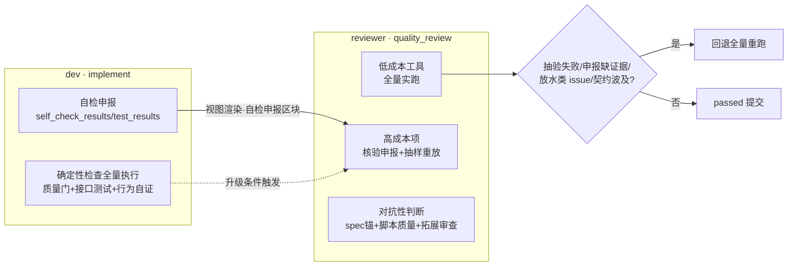

# 设计：simple 模式验证分流（dev 自检与 review 去重复/去过拟合）

## 1. 现状与证据

simple 流程（`assets/workflows/task-simple.yaml`）中 dev（implement）与 reviewer（quality_review）的验证行为对照：

| 验证行为 | dev（implement） | reviewer（quality_review） | 重复性质 |
|---|---|---|---|
| 确定性工具（构建/格式/静态分析/架构约束/深度扫描/覆盖率） | L42 本地构建验证+覆盖率门禁 | L69 必做清单逐项全量执行 | 工具幂等，重跑增量信息仅为「dev 是否虚报」 |
| 接口测试（SQL 前置+隔离启动+执行 .http） | L35 完整执行顺序，结果纳入 self_check_results | L71-③ 独立执行全量 API 测试 | 同脚本同环境同链路，仅执行者不同 |
| 服务启动/健康 | L34 隔离启动自证 | L71-② 启动服务并检查健康 | dev 刚启动验证过，reviewer 重启 |
| 维度规范审查（style/architecture/performance/security/maintainability） | L44-45 按维度 skill 全检查点自检（变更文件锚点），按维度逐项申报 | L75 加载同批维度 skill，以 diff 为锚点拓展审查 | 同清单同锚点，视角同构 |
| 环境清理 | L36 自证完成后停止实例 | L72 幂等清理 | 同一环境的两轮启停清理 |

对抗性职责（L71-① task 产出完整性、④ 测试代码质量、⑤ 业务行为真实性、⑥ 关键数据产出核验）为 reviewer 独有，不属重复；重复发生在确定性执行与维度清单核对两块。

机制层断点：

- `self_check_results` 写入 metadata（`src/core/tools/submit.ts:311-313`），`src/core/views.ts` / `src/core/workflow/status.ts` 无任何渲染点——reviewer 看不到 dev 的自检结论与证据。
- 质量门必做清单门禁（`src/core/tools/gate.ts` `uncoveredMustDo`）仅两个调用点：review 提交（`submit.ts:431-441`，`handleReviewParams`）与 giveup 检查点（`submit.ts:838`）。implement 走 `handleImplementParams`（`submit.ts:268-314`），仅处理 blocker / completed_task_ids / self_check_results；`validation_steps` 在 schema 中标注为 review step 专用（`schemas.ts:337-341`），dev 传入会被静默忽略。
- `agent_summaries` 按角色隔离渲染（`views.ts:158-163`，409c411 意图：不跨 agent 传递）——跨 agent 的上下文传递通道整体缺失。

## 2. 根因（5-Why 收敛）

1. review 为何全量重复 dev 自检？——quality_review 指令要求亲自全量执行工具、API 测试与维度审查。
2. 指令为何这样要求？——机制上 reviewer 无法复用 dev 证据：self_check_results 不进视图，门禁只认 reviewer 自己的 validation_steps。
3. 机制为何不支持复用？——设计上「审查 = 重新执行 + 重新判断」一体：跨 agent 上下文被有意隔离，验证执行被定义为审查者本职。
4. 为何执行与判断不拆分？——验证行为未按性质建模：确定性检查（幂等、可复验、可申报）与对抗性判断（需独立视角）被同一套「审查者亲自做」语义覆盖。
5. **系统性根因**：编排语义中验证的执行归属（谁执行、证据在哪）与验证性质（确定性/判断性）未建模；门禁只校验「reviewer 的 validation_steps 覆盖必做项」，dev 执行无对等申报通道与门禁，重复执行成为唯一可通过门禁的形态。

## 3. 目标状态与分流模型

划分标准：

- **确定性检查**：给定相同输入结果恒定（工具链、构建、静态分析、深度扫描、既有 .http 脚本重放）。防伪靠「工具输出不可伪造」——重跑即核验，核验申报+抽验即抽样核验。
- **对抗性判断**：结论依赖审查者独立视角（断言是否放水、Mock 是否过度、行为是否真实生效、数据是否落对位置、清单外缺陷）。防伪靠「读脚本/实现对照 spec」——重复执行对此无效。

成本分级（依据 quality-gate skill must_do：env/compile/format/architecture/static_analysis/unit_test/coverage/deep_scan/config_check）：

| 分级 | 必做项 | reviewer 复验方式 |
|---|---|---|
| 低成本（分钟级） | env/compile/format/architecture/static_analysis/unit_test/config_check | 全量实跑（防虚报锚点，成本可控） |
| 高成本（十分钟级/环境启停） | deep_scan；全量 API 测试（L71-②③，非 must_do 项但同属高成本执行） | 核验 dev 申报证据 + 按必做项 token 申报覆盖（仅 deep_scan）+ 核心链路抽样重放 + 脚本质量审查 |

## 4. 方案设计

### 4.1 自检申报视图化（唯一代码改动）

- `views.ts` 新增渲染函数：输出「开发者自检申报」区块（质量门执行结论、按维度自检结论、接口测试证据），数据源为 workItem metadata 的 `self_check_results` 与 `test_results`。
- `status.ts` 在 quality_review（review_merged）视图组装中调用。
- 与 `renderAgentSummaries` 的语义区分须注释说明：会话摘要是按角色隔离的辅助记忆；自检申报是正式提交参数存档，跨角色可见是设计意图（reviewer 复验的事实输入），不违反「子代理上下文不得转述」——该条约束编排者在分派 prompt 中转述，视图渲染动态上下文（worktree 路径、issue 清单、待复核清单）本就是 opx_status 工具本职。
- implement 指令强化申报结构：self_check_results 须含每项检查的命令与结果摘要（证据可核验），接口测试附执行顺序与覆盖接口清单。

### 4.2 分级复验规则（quality_review 指令重写）

- 低成本必做项：保留全量实跑与逐项申报（现状 L69 表述不变的部分）。
- deep_scan：核验 dev 申报（证据完整性、命中项与 diff 的合理性）+ 抽验命中项（如本地复跑单规则静态分析验证命中真实存在）；申报形态为 step 名首段 `deep_scan`、completed=true、描述注明核验方式与抽验样本。升级条件：申报缺证据 / 抽验不符 / 发现压制类 issue → 本轮改为实跑。
- 全量 API 测试 + 服务健康（L71-②③）：改为「按 spec 验收标准选样的核心链路抽样重放（1-2 条端到端，覆盖创建-检索-变更-删除闭环中 spec 声明的关键行为）+ `.http` 脚本质量审查（L71-④ 对照 spec 核断言覆盖/放水/Mock 过度——防作弊主力）」。服务健康并入抽样重放（能重放即健康）。纯测试代码变更的豁免分支（L73）不变。
- 升级回退全量重跑的触发条件（统一四处）：dev 申报缺证据或不完整 / 抽验失败 / 发现断言放水类 issue / 本轮为修复轮且修复波及接口契约或数据口径。
- 对抗性判断（L71-①④⑤⑥）全部保留；维度拓展审查（L75）锚点调整：以 spec 验收标准、行为组与数据产出要求为锚做对照审查，skill 清单与 dev 申报对照兜底（抽查申报遗漏项）——检查点清单仍同源锚定同一 skill（满足治理原则「同一维度跨阶段审查检查点一致」），仅执行模式从「reviewer 重走清单」变为「dev 申报走清单 + reviewer 兜底抽查 + reviewer 主力在清单外」。
- 清理职责（L72）保留：抽样重放同样按清理规范收尾。

**门禁兼容取舍**（三选一，选第三）：核验申报需要通过 uncoveredMustDo，候选方案为 ① 扩展 skip_reason 的 adjudication 枚举增加「策略性复用」类别——把复用塞进「降级」语义不干净，且全链路（schema/视图/错误提示）侵入大；② 调整 quality-gate skill 的 must_do 拆分低成本/高成本——skill 为全模式共用，影响 full 模式 verify_tool 语义；③ **核验申报定义为 completed=true 的合法覆盖形态**（执行了核验也是执行），uncoveredMustDo 仅按 step 名 token 命中判定覆盖，机制天然兼容，只需 workflow 指令白名单限定「仅高成本必做项（deep_scan）允许核验申报形态，低成本项必须实跑」并以 must-do-gate 回归用例固化口径，同步 gate.ts/submit.ts 头注释。选③：零机制改动、语义弱化风险由白名单+回归用例封住。

### 4.3 修复轮次收敛

simple 状态机为 quality_review on_fail → implement 整步回退，本轮方案不改状态机，仅指令级分口径：

- 首轮：按 4.2 分级复验全项执行。
- 复核轮（二轮起）：聚焦被修复 issue 相关面 + 本轮修复 diff 波及面 + dev 再自检申报（dev 修复轮已按 L35/L44 重跑接口测试与维度自检）；首轮已通过且无波及的维度与低成本工具结论不重审，但低成本工具实跑保留（成本分钟级，防修复引入回归的性价比最高项）。
- 同步改写两处既有指令避免自相矛盾：L71「逐项验证①-⑥」区分首轮/复核轮口径；L96「工具检查及 issue 报告覆盖全量代码」限定为低成本实跑项与首轮对抗审查（高成本项按核验申报口径）。

### 4.4 agent 定义与文档同步

- `openspec-reviewer.md`：simple 合并审查者角色定位表述调整为「分级复验与对抗审查」（分流细则不写入 agent.md——三层职责分离，操作指引归 workflow 配置）；审查内容区块补维度审查锚点策略一句（spec 锚为主、skill 清单兜底）。
- `openspec-developer.md`：角色定位补充「质量门与接口测试的执行责任人，自检申报是 reviewer 复验的事实输入」；保留「自检不替代 reviewer 裁定」（裁定权归属不变，变的只是执行模式）。
- README：simple 模式验证分流语义说明。
- `gate.ts` / `submit.ts` 头注释：必做覆盖口径补充「高成本必做项允许核验申报形态（completed=true + 核验描述），仅限 workflow 指令白名单项」。

## 5. 连锁影响推演（沿状态机全链路）

- **必做清单门禁**：核验申报 token 命中（`deep_scan:核验…`）→ uncoveredMustDo 视为覆盖，passed 提交不被拦截；低成本项被虚报核验形态 → 由指令白名单约束（提示词级），回归用例固化机制口径。风险接受：LLM 违反白名单用核验形态申报低成本项时无工具层拦截，兜底为门禁错误提示中明示「低成本项必须实跑申报」。
- **giveup 检查点**（`submit.ts:838` 读 metadata["validation_steps"]）：P0 不改 dev 侧申报通道（dev 继续用 self_check_results 自由文本），validation_steps 仍仅 reviewer 写入，giveup 读点无污染。P1 引入 dev 侧申报时必须用独立 metadata key 并隔离该读点。
- **同 key 覆盖**：P0 中 dev 不写 validation_steps，无覆盖冲突；P1 设计已预防（独立 key）。
- **no_change / 纯测试代码豁免分支**（L69/L73）：与分级复验正交，不变。
- **full 模式**：零改动（task.yaml 不动）。full 的 implement（L56 同含 quality-gate tag）不引入 dev 门禁，避免改变 full 模式 dev 提交失败形态；full 侧是否复用分流模式依 P0 效果另行评估。
- **谁提谁裁定 / issue 状态机**：分流只改执行方式，issue 上报、复核、豁免裁定链路零改动。
- **收尾**：simple 收尾为裸合并（无回归、无环境清理，agent-merge-and-mode-config proposal L10），quality_review 仍是唯一防线——见风险权衡。

## 6. 风险与权衡

1. **dev 虚报残余窗口**：非核心链路接口的申报虚报仅靠「申报证据核验 + 脚本质量审查 + 升级条件」间接防御。接受理由：simple 定位轻量变更；低成本工具全量实跑兜住工具可检虚报；抽样重放兜住「完全没跑」；脚本审查兜住「跑了但放水」。残余窗口与轻量变更的风险敞口匹配。
2. **completed=true 语义弱化**：核验申报形态可能被滥用于低成本项。缓解：指令白名单 + 门禁错误提示明示 + must-do-gate 回归用例固化。
3. **裸合并收尾依赖前移**：quality_review 收窄执行面后，最终合并前无回归复验。缓解：升级条件四类触发即回退全量；修复轮保留低成本工具实跑（防回归性价比最高项）。
4. **指令自相矛盾**：4.3 未彻底改写 L71/L96 时新旧口径并存。已列入改动清单逐条改写。

## 7. P1 展望：dev 申报门禁对称化（依 P0 效果另行立项）

- `handleImplementParams` 增加验证申报校验与存档：独立 metadata key（如 `dev_validation_steps`），与 reviewer 的 `validation_steps` 隔离——避免 review 提交覆盖 dev 申报（`submit.ts:425` 同 key 写入）、避免 giveup 读点（`submit.ts:838`）被 dev 申报抵扣污染。
- schemas.ts / types.ts 参数语义扩展（validation_steps 去 review-only 标注或新增 dev 专用参数）。
- 适用范围：full 模式 implement 同含 quality-gate tag，统一实施会改变 full dev 提交失败形态；建议 P1 仅 simple 生效或 full 侧同步评估。
- 后置理由：P0 的升级条件已兜住 dev 申报不完整的窗口（申报缺证据 → reviewer 全量复验），门禁化的增量收益（申报完整性前置拦截）依 P0 实施效果评估是否值得工具改动成本。

## 8. 测试清单

- `tests/opx_status_workflow.test.ts`：quality_review 视图渲染「开发者自检申报」区块（self_check_results/test_results 存在时展示、缺失时不渲染空区块）；implement 视图不渲染该区块。
- `tests/workflow.views.test.ts`：渲染函数单元行为。
- `tests/orchestrate.simple-e2e.test.ts`：分流后流程行为（首轮/复核轮提交形态、validation_steps 申报通过门禁）。
- `tests/must-do-gate.test.ts`：核验申报形态（step 名 token 命中 + completed=true）通过 uncoveredMustDo；低成本项口径在门禁错误提示中明示（回归固化）。
